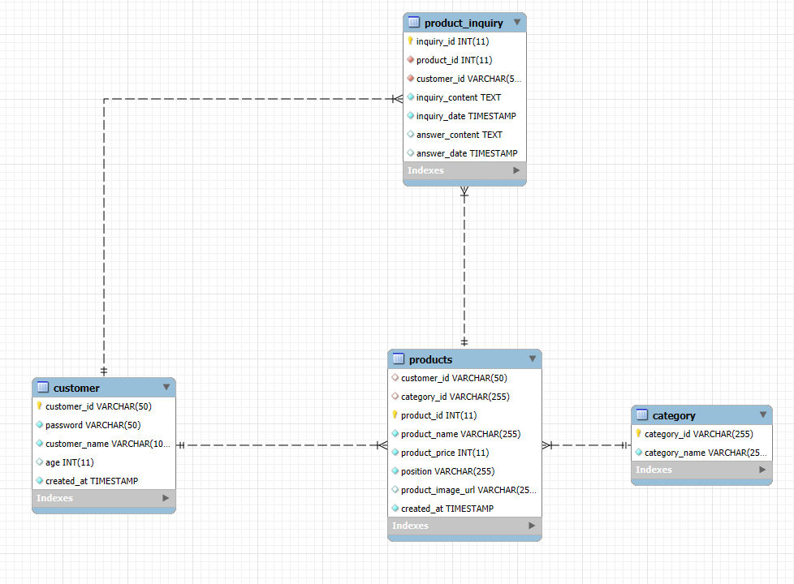
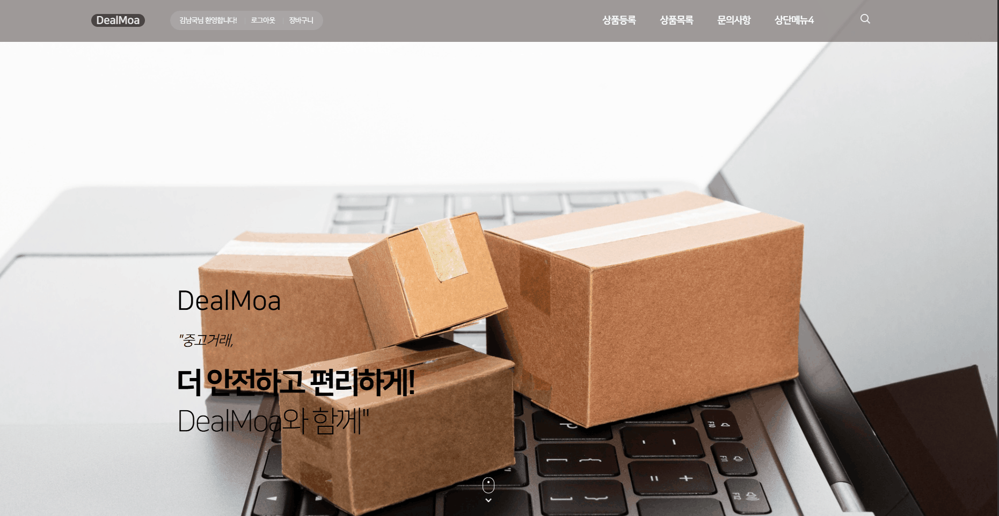
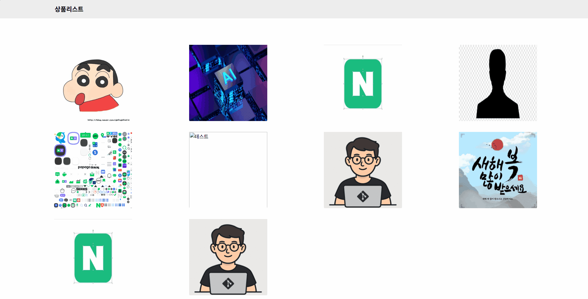

중고나라 사이트 (DealMoa) 🌟

프로젝트 소개 📦
중고나라 사이트는 사용자가 중고 물품을 사고팔 수 있는 온라인 마켓플레이스입니다. 사용자 친화적인 인터페이스를 제공하여 물품 등록, 검색, 거래가 원활하게 이루어집니다. 스프링 프레임워크, 마이바티스, MySQL, HTML, CSS, JavaScript를 활용하여 구축된 이 프로젝트는 효율적인 데이터 관리와 직관적인 UI를 제공.

## 🛠 사용 기술

- **백엔드**: 
  
  
  
  

- **데이터베이스**: 
  

- **프론트엔드**: 
  
  
  

- **개발 환경**: 
  

 ## 📊 데이터베이스 설계

## 🚀 주요 기능

- 
  
- 
- 
- 

 ## 🚀 메인페이지 회사소개
 - 

 ## 🚀 로그인 및 로그아웃 기능
- 

  
  ## 🚀 상품등록 기능
- 

    ## 🚀 상품에 대한 문의 기능
- 

## 🚀 미구현 기능

- 
- 
- 
- 
- 
